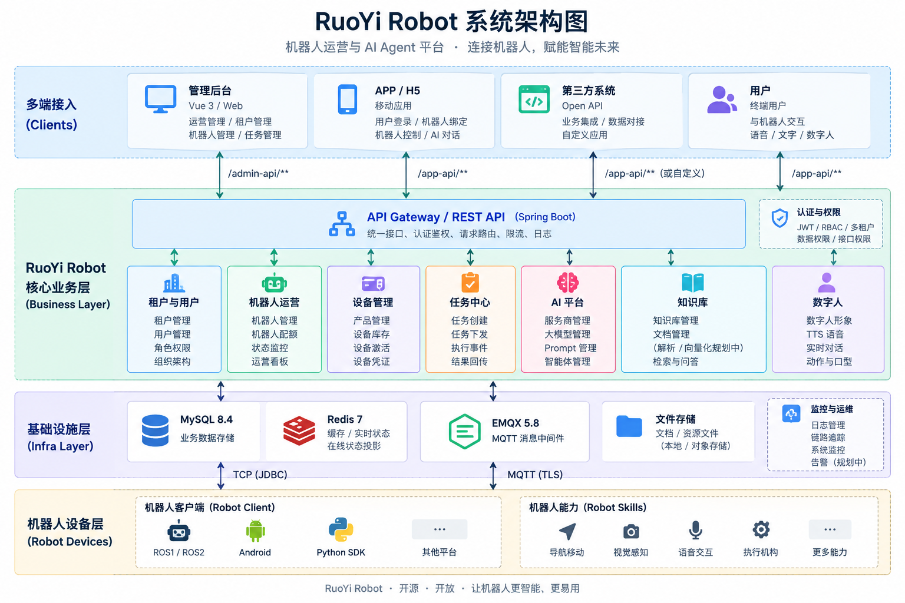
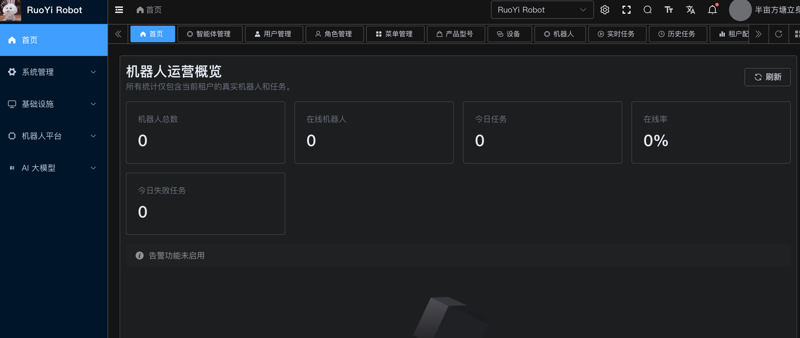

# 🤖 RuoYi Robot

> 开源的机器人运营与 AI Agent 平台，让机器人快速拥有云端管理、设备接入、任务调度、AI 智能体与数字人能力。

**RuoYi Robot** 是一个面向机器人、具身智能和 AI 应用的开源平台，基于 **RuoYi-Vue-Pro** 二次开发。

项目将传统 IoT 设备管理、机器人运营平台与 AI Agent 能力结合，为家庭机器人、服务机器人、巡检机器人、陪伴机器人以及机器人开发团队提供统一的云端基础设施。

平台支持机器人设备接入、MQTT 通信、在线状态、任务下发、机器人绑定、多租户运营，并提供大模型、Prompt、Agent、知识库、Realtime Agent、长期记忆和数字人等 AI 能力。

✨ 为什么做 RuoYi Robot

开发一款真正可运营的机器人产品，除了 ROS、导航、视觉、语音等机器人端能力，还需要大量云端基础设施：

- 机器人设备注册、激活和认证
- MQTT 长连接与实时状态
- 机器人任务下发和执行结果回传
- 用户与机器人绑定
- 多租户与权限管理
- OTA 与设备运维
- AI 大模型接入
- Agent 与机器人能力调用
- 知识库和长期记忆
- 实时语音交互
- 数字人
- Web / APP / H5 接入

RuoYi Robot 希望把这些通用能力沉淀为一个可复用的开源平台。

机器人团队可以把更多精力放在机器人本身，而不是重复开发账号、权限、设备管理、MQTT、任务系统和 AI 基础设施。

# 🏗️ 系统架构



# 🔐 API 架构

RuoYi Robot 根据调用方划分三套 API 安全边界：

| 调用方         | API              | 用途                                       |
| -------------- | ---------------- | ------------------------------------------ |
| 管理后台       | `/admin-api/**`  | RBAC、机器人、设备、任务、AI、运营管理     |
| Robot / Device | `/device-api/**` | Heartbeat、配置、任务 ACK、事件和结果      |
| APP / H5       | `/app-api/**`    | 用户登录、机器人绑定、机器人状态与用户操作 |

三种 API 使用不同身份认证和授权边界，Token 不可互换。

# 🚀 核心能力

## 🤖 机器人运营

提供机器人从设备入库、激活、上线到运营管理的完整基础能力。

主要包括：

- Product 产品管理
- Device Inventory 设备库存
- 机器人激活
- 设备凭证管理
- 机器人在线 / 离线状态
- 电量、版本等状态信息
- 机器人详情
- 用户与机器人绑定
- 多租户机器人隔离
- 机器人配额管理
- 机器人运营 Dashboard

## 📡 设备与 MQTT

平台内置 EMQX 集成，通过 MQTT 实现机器人与云端之间的实时通信。

支持：

- 设备身份认证
- MQTT 设备连接
- Heartbeat 心跳
- 在线状态维护
- 状态上报
- 云端指令下发
- ACK
- 任务执行事件
- 任务结果回传
- 消息幂等
- 租户隔离
- Redis 实时状态投影

机器人可以使用：

```
Robot
  │
  ├── Heartbeat
  ├── Telemetry
  ├── Mission ACK
  ├── Mission Event
  └── Mission Result
  │
 MQTT
  │
  ▼
RuoYi Robot Cloud
```

完成机器人和云平台之间的双向通信。

## 📋 机器人任务

平台提供统一机器人任务模型，可用于：

- 移动
- 导航
- 做家务
- 巡检
- 拍照
- 视频
- 找人
- 找物
- 回充
- 自定义机器人技能

典型任务链路：

```
创建任务
   ↓
云端下发
   ↓
MQTT
   ↓
机器人 ACK
   ↓
机器人执行
   ↓
执行事件
   ↓
任务结果
   ↓
云端持久化
```

为后续 Robot Agent 自动调用机器人能力提供统一任务基础。

# 🧠 AI 大模型与 Robot Agent

RuoYi Robot 不仅是机器人设备管理平台，同时提供 AI Agent 基础能力。

平台支持统一管理：

- AI 服务商
- 大模型
- Prompt
- Agent
- Robot ↔ Agent 绑定
- AI 对话
- Realtime Agent
- 长期记忆
- 知识库
- 数字人
- TTS

机器人可以绑定不同 Agent，从传统的：

```
用户 → APP → API → 机器人任务
```

逐渐演进为：

```
用户
 │
 ▼
AI Agent
 │
 ├── LLM
 ├── Knowledge Base
 ├── Memory
 ├── Tools
 └── Robot Skills
        │
        ▼
     Mission
        │
       MQTT
        │
        ▼
      Robot
```


从而让机器人从“接受固定指令”升级为“理解任务并执行任务”。

# 📚 知识库

平台已经提供知识库和纯文本知识文档管理基础能力，可与 Agent 建立关联。

规划中的完整 RAG 链路：

```
PDF / Word / Markdown / TXT
            ↓
        文档解析
            ↓
          Chunk
            ↓
        Embedding
            ↓
       Vector Store
            ↓
         Retrieval
            ↓
           LLM
            ↓
          Agent
```

> 当前版本已经支持知识库和纯文本知识文档管理；文件上传解析、Embedding、向量数据库和语义检索仍在持续建设中。

# 🎭 Digital Human

RuoYi Robot 提供建立在 **Realtime Agent** 之上的数字人能力。

数字人可以配置：

- 数字人形象
- Agent
- TTS 模型 / 音色
- 欢迎语
- 打断策略
- 口型策略
- 状态动作

当前支持可切换的渲染后端：

```
STATIC_2D
LIVETALKING（WebRTC 实时音视频）
```

LiveTalking 支持选择服务实例和形象，实时回答音频驱动口型，支持打断。可通过不同实例切换 Wav2Lip、MuseTalk 等模型。管理端可连接视频并试听，部署、接口和联调步骤见 [LiveTalking 数字人接入](docs/digital-human-livetalking.md)。旧配置默认使用静态形象，无需数据库迁移。

并预留：

```
Live2D
3D Avatar
Third-party Renderer
```

统一 Renderer 接口。

整体链路：

```
Microphone
    ↓
Realtime Agent
    ↓
   LLM
    ↓
   TTS
    ↓
Digital Human Renderer
    ↓
Avatar + Voice + Lip Sync
```


# 🧱 技术栈

## Backend

| 技术           | 用途                   |
| -------------- | ---------------------- |
| Java 17        | 后端开发语言           |
| Spring Boot    | 应用框架               |
| RuoYi-Vue-Pro  | 基础后台框架           |
| Maven          | Java 工程管理          |
| MySQL 8.4      | 业务数据               |
| Redis 7        | 缓存、实时机器人状态   |
| EMQX 5.8       | MQTT Broker            |
| MQTT           | Robot ↔ Cloud 实时通信 |
| Docker Compose | 本地基础设施部署       |

后端采用 **Modular Monolith（模块化单体）** 架构，主要模块使用：

```
robot-platform-*
```

Java package：

```
com.robot.platform
```

## Frontend

| 技术       | 用途         |
| ---------- | ------------ |
| Vue 3      | 管理后台     |
| TypeScript | 前端开发语言 |
| Vite       | 构建工具     |
| pnpm       | 包管理       |

管理后台：

```
robot-platform-ui-admin
```

## AI

AI 层主要围绕：

```
LLM Provider
      ↓
Model
      ↓
Prompt
      ↓
Agent
      ↓
Knowledge / Memory / Tools
      ↓
Robot Skill
```

设计。

可用于接入不同的大模型服务和机器人能力。

# 📦 项目结构

```
ruoyi-robot
│
├── robot-platform-server
│
├── robot-platform-framework
│
├── robot-platform-dependencies
│
├── robot-platform-module-system
│
├── robot-platform-module-infra
│
├── robot-platform-module-tenant
│
├── robot-platform-module-member
│
├── robot-platform-module-device
│
├── robot-platform-module-robot
│
├── robot-platform-ui-admin
│
├── robot-simulator
│
├── docker
│
├── scripts
│
├── sql
│
└── docs
```

# 🖼️ 功能演示

> 建议将截图统一放到 `docs/images/`。

## Dashboard


机器人数量、在线状态、任务趋势等运营数据。




# 🚀 Quick Start

## 环境要求

建议：

```
JDK       17+
Maven     3.9+
Docker    Docker Compose v2
MySQL     8.4
Redis     7
EMQX      5.8
Node.js   20.19+ / 22.12+
pnpm      9+
```

## 1. Clone

```
git clone https://github.com/longscoop/ruoyi-robot.git
cd ruoyi-robot
```

## 2. 配置环境变量

在项目根目录创建：

```
.env
```

至少配置：

```
MYSQL_PASSWORD
MYSQL_ROOT_PASSWORD

EMQX_NODE_COOKIE
EMQX_DASHBOARD_PASSWORD

MQTT_CALLBACK_TOKEN
MQTT_CLOUD_USERNAME
MQTT_CLOUD_PASSWORD

ROBOT_SECRET_MASTER_KEY
ROBOT_AI_SECRET_KEY_BASE64
```

设备凭证和 AI 凭证分别使用独立 32 字节随机密钥，例如：

```
openssl rand -base64 32
```

> 首次配置后请妥善保存密钥，不要随意更换，也不要将 `.env`、设备 Secret、MQTT Secret 或 AI Provider Secret 提交到 Git。

## 3. 启动基础设施

```
docker compose up -d --wait mysql redis emqx
```

默认启动：

```
MySQL
Redis
EMQX
```

EMQX Dashboard：

```
http://127.0.0.1:18083
```

## 4. 启动 Backend

```
set -a
source .env
set +a

mvn -pl robot-platform-server -am -DskipTests package

java -jar robot-platform-server/target/robot-platform-server.jar \
  --spring.profiles.active=local
```

默认地址：

```
http://127.0.0.1:48080
```

首次启动时 Docker Compose 会初始化：

```
sql/mysql/ruoyi-vue-pro.sql
sql/mysql/quartz.sql
sql/mysql/robot-platform.sql
```

## 5. 启动管理后台

```
cd robot-platform-ui-admin

pnpm install --frozen-lockfile
pnpm dev
```

默认：

```
http://localhost:80
```

## 6. 登录

本地开发环境默认管理员：

```
Tenant:   RuoYi Robot
Username: admin
Password: admin123
```

> 该账号仅用于本地首次启动。生产环境必须修改默认密码并创建独立管理员。

# 🤖 接入第一台机器人

推荐流程：

```
创建 Tenant
     ↓
创建 Product
     ↓
创建设备
     ↓
激活 Device
     ↓
获取 Device Credential
     ↓
Robot 连接 MQTT
     ↓
发送 Heartbeat
     ↓
Robot Online
     ↓
Cloud 创建 Mission
     ↓
Robot ACK
     ↓
Robot Execute
     ↓
Result
```

可以先使用项目自带：

```
robot-simulator
```

模拟真实机器人完成整个 MQTT 链路。

# 🧪 E2E 验证

项目提供真实 MQTT Broker 闭环验证：

```
set -a
source .env
set +a

scripts/e2e/core-platform.sh
```

验证：

```
Device
  ↓
EMQX
  ↓
Cloud
  ↓
Mission
  ↓
ACK
  ↓
Event
  ↓
Result
```

整个核心链路。

# 🗺️ Roadmap

RuoYi Robot 将继续围绕 **Robot Cloud + Robot Agent** 演进。

计划包括：

- Robot Python SDK
- ROS1 SDK / Bridge
- ROS2 SDK / Bridge
- OTA
- Robot Log Center
- Remote Diagnostics
- Remote Control
- Map Management
- Robot Skill / Capability
- Agent Tool Calling
- Robot Workflow
- 完整 RAG
- Vector Database
- Long-term Memory
- Realtime Voice Agent
- Live2D Digital Human
- 3D Digital Human
- WebRTC Video
- APP / H5 Robot Console

最终希望形成：

```
              RuoYi Robot

       Robot Cloud Platform
                +
          Robot AI Agent
                +
      Robot Developer Platform
```